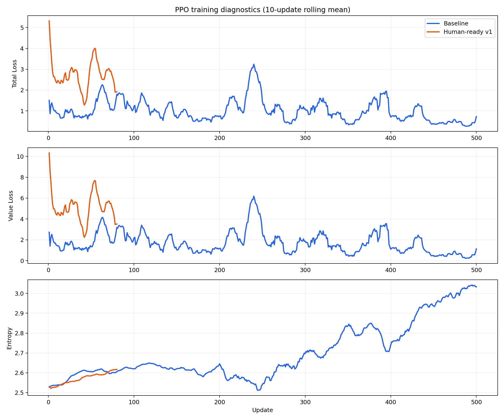
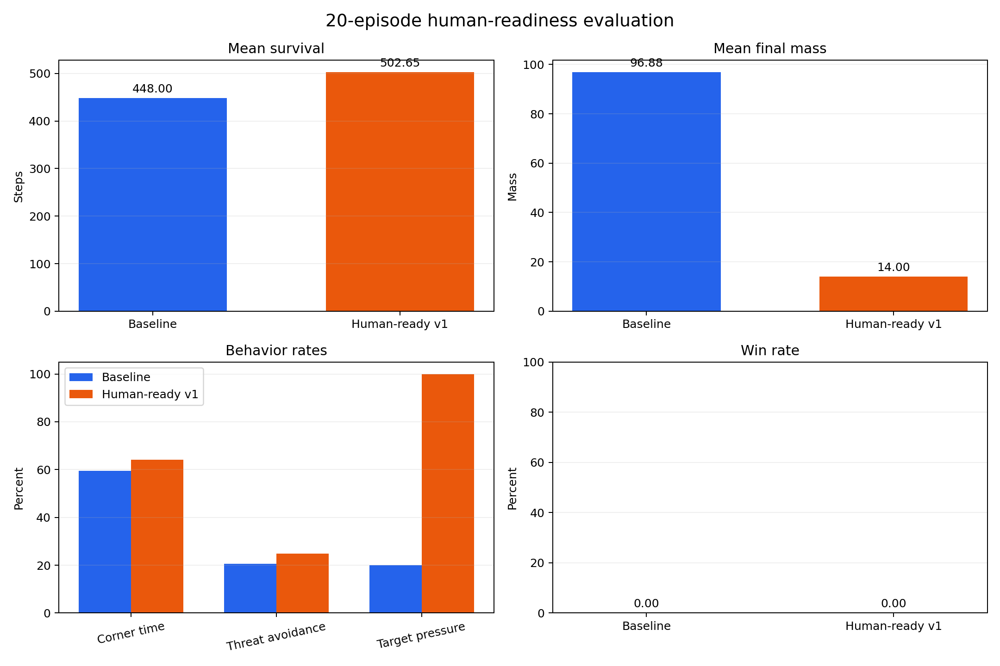
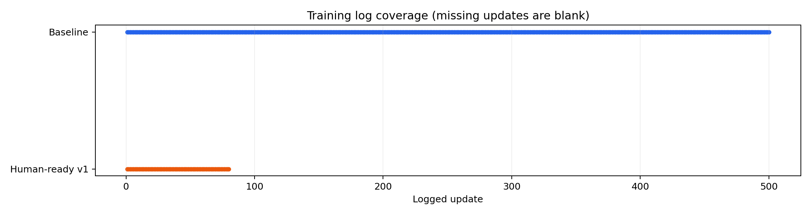

# Agario RL

A small Agar.io-style reinforcement-learning experiment you can watch, play,
train, and evaluate on your own machine.

The game does not control or scrape the public Agar.io website. It runs inside a
deterministic Python simulator, while a TypeScript canvas app renders the live
world in your browser.



## Try the game

You need Python 3.11 or newer and Node.js.

```powershell
python -m venv .venv
.\.venv\Scripts\Activate.ps1
python -m pip install -e .[dev]
python scripts/run_game.py
```

The game opens at `http://127.0.0.1:5173/`.

Choose a mode:

- **Showcase** — watch bots compete.
- **Play** — control the blue cell with the mouse or arrow keys.
- **Training view** — watch the arena with learning telemetry visible.

In Play mode:

- move the mouse or use the arrow keys to steer
- press **Space** to split
- press **W** to eject mass
- press **R** to reset the arena

You can also start a mode directly:

```powershell
python scripts/run_game.py --mode showcase
python scripts/run_game.py --mode play
python scripts/run_game.py --mode training-view
```

## What you are looking at

Python owns the game rules. It moves cells, resolves collisions, calculates
rewards, and chooses bot actions. The browser receives snapshots over a
WebSocket and draws them smoothly between simulator steps.

On screen:

- colored circles are players
- small dots are food pellets
- green spiked circles are viruses
- arrows point toward important off-screen threats and targets
- the minimap shows the full arena
- the side panels show mass, population, policy source, training update, split
  safety, and runtime FPS

This separation keeps training reproducible: browser rendering cannot change
the world or the reward calculation.

## Current results

The repository contains two 20-episode human-readiness evaluations. The
human-ready checkpoint survived longer and applied more pressure to smaller
targets, but it finished with much less mass, spent more time in corners, and
neither checkpoint won an episode.



| Metric | Baseline update 500 | Human-ready update 80 |
| --- | ---: | ---: |
| Win rate | 0% | 0% |
| Mean survival | 448.00 steps | 502.65 steps |
| Mean final mass | 96.88 | 14.00 |
| Time in corners | 59.46% | 64.14% |
| Threat avoidance | 20.53% | 24.77% |
| Small-target pressure | 20.00% | 100.00% |

These are proxy metrics, not proof that the policy is ready to play well with a
person. See [experiment results](docs/experiment-results.md) for the full
interpretation and data coverage.

## Train a policy

Run the classic setup:

```powershell
python scripts/train.py --updates 20 --device auto
```

Run the mixed-opponent setup:

```powershell
python scripts/train_human_ready.py --updates 80 --device auto
```

Run the richer curriculum:

```powershell
python scripts/train.py --updates 20 --scenario-preset agario_curriculum --continuing-respawn --device auto
```

Training writes checkpoints under `checkpoints/` and metrics under `logs/`.
`--device auto` selects CPU, CUDA, or Intel XPU support when available.

## Evaluate a checkpoint

```powershell
python scripts/eval.py --checkpoint checkpoints/latest.pt --episodes 5 --deterministic --device auto
python scripts/eval_human_readiness.py --checkpoint checkpoints/human_ready_v1/latest.pt --episodes 20
```

Report the checkpoint, episode count, scenario, seed, and exact command whenever
you compare runs. A lower PPO loss alone does not mean better gameplay.

## Regenerate the charts

```powershell
python scripts/generate_report_assets.py
```

The script reads the tracked CSV and JSON results and replaces the three images
under `docs/assets/`.



## Project map

```text
agario_rl/env/       simulator, observations, rewards
agario_rl/rl/        PPO networks, buffers, trainer
agario_rl/web/       FastAPI, WebSocket runtime, frame format
web/                 browser canvas frontend
scripts/             run, train, evaluate, benchmark, chart tools
tests/               simulator, training, and browser-runtime tests
docs/                setup, controls, architecture, and results
```

Useful reading:

- [Quickstart](docs/quickstart.md)
- [How the policy learns](docs/how_it_learns.md)
- [Controls and tuning](docs/controls_and_tuning.md)
- [Runtime architecture](docs/runtime_architecture.md)
- [Experiment results](docs/experiment-results.md)

## Verify the project

```powershell
.\.venv\Scripts\python.exe -m pytest
cd web
npm install
npm run build
```

The project is an experiment, not a production game service. Its strongest
property is that the simulator, training loop, evaluation data, and browser
view are all local and inspectable.
