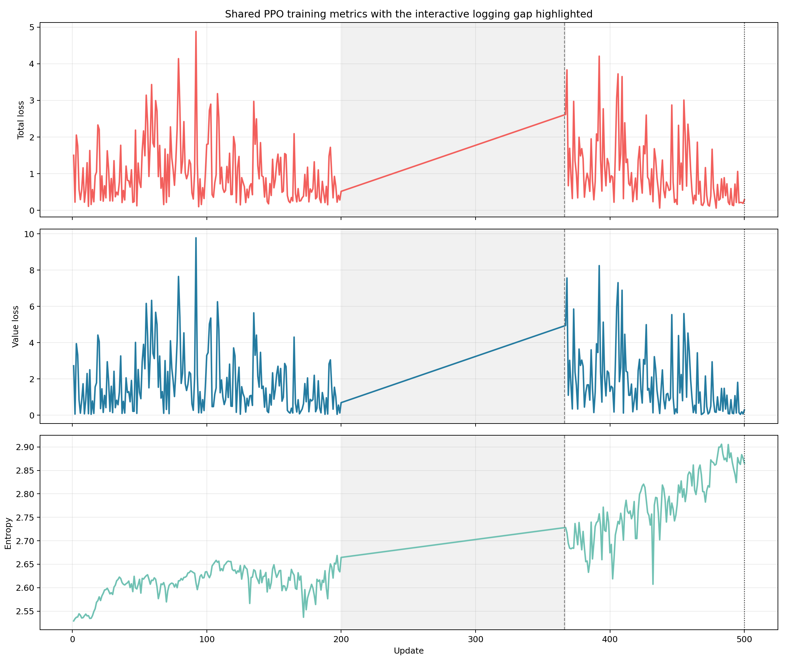
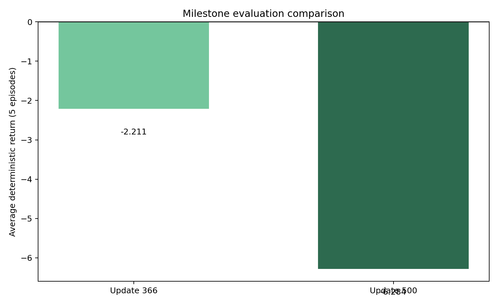
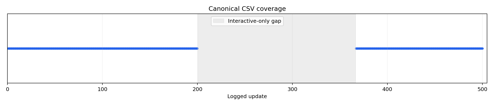

# Experiment results

This page captures the current public state of the Agar.io reinforcement
learning experiment. It preserves the update `366` checkpoint as a reportable
milestone, records the continued run to update `500`, and explains the gap in
the CSV history honestly instead of inventing missing data.

## Summary

The experiment now has two comparable milestones from the same checkpoint
lineage. Update `366` is the last checkpoint before the April 2, 2026
continuation run. Update `500` is the result of resuming that exact state to a
new target milestone with canonical logging enabled.

## Milestone observations

The most useful observations are still qualitative. They explain how the
policy looked to a human observer before the quantitative artifacts were
strong enough to stand on their own.

### Around update 100

At roughly update `100`, one agent would often eat another and then the two
remaining agents drifted toward the corners. That behavior is consistent with
an early short-term reward bias: agents were learning that immediate survival
and opportunistic elimination worked, but they were not yet sustaining a more
natural predator-prey loop across the whole map.

### Around update 300

At roughly update `300`, the behavior looked more natural. Agents were more
likely to chase smaller opponents, disengage from larger opponents, and trade
space in a way that resembled recognizable Agar.io instincts instead of simply
collapsing into corners.

### Update 366 baseline

Update `366` is the last stable checkpoint before the continuation run. The
repository did not have canonical CSV logging for every interactive update in
that phase, so this milestone is preserved as a checkpoint snapshot plus a
deterministic evaluation summary.

| Metric | Value at update `366` |
| --- | ---: |
| Policy loss | `0.0080` |
| Value loss | `63.5176` |
| Entropy | `2.7028` |
| Imitation loss | `0.8676` |
| Total loss | `31.9133` |
| Batch size | `1038` |
| Deterministic evaluation average return | `-2.211` |

The deterministic 5-episode baseline at update `366` produced these winners:

- Episode 1: `agent_1`
- Episode 2: `agent_0`
- Episode 3: `agent_2`
- Episode 4: `agent_2`
- Episode 5: `agent_2`

### Update 500 continuation

Update `500` came from continuing the update `366` checkpoint with the new
resume-aware training path. The final checkpoint was written to
`checkpoints/checkpoint_00500.pt`, and the canonical CSV now includes updates
`367..500`.

| Metric | Value at update `500` |
| --- | ---: |
| Policy loss | `-0.0160` |
| Value loss | `0.2942` |
| Entropy | `2.8653` |
| Imitation loss | `0.9404` |
| Total loss | `0.2905` |
| Batch size | `2049` |
| Deterministic evaluation average return | `-6.284` |

The deterministic 5-episode evaluation at update `500` produced these winners:

- Episode 1: `agent_1`
- Episode 2: `agent_2`
- Episode 3: `agent_1`
- Episode 4: `agent_2`
- Episode 5: `agent_0`

## How to read the current results

The continuation run improved the final reported losses dramatically, but the
quick deterministic evaluation did not improve with it. In other words, the
optimizer looks more settled by update `500`, while the five-episode
evaluation slice looks worse than the `366` baseline.

That does not prove the policy regressed globally. It does mean the current
public claim must stay conservative: the agents look more structured than they
did early in training, but the evaluation story is not yet strong enough to
claim a clear performance jump from `366` to `500`.

## Logging coverage

The current CSV is canonical, but it is not continuous. The repository logs
updates `1..200`, then a gap, then updates `367..500`. The missing interval
comes from an older interactive-training phase that advanced the checkpoint
without recording every update to `logs/train_metrics.csv`.

The repo does not fabricate rows for that missing interval. Instead, it keeps
the `366` checkpoint as a named milestone and shows the logging gap directly.

## Human-play mode

The repository now includes `scripts/play.py`, which places one human player
into the same three-slot world as the trained agents. This mode exists to help
you answer a question that the quick deterministic evaluation cannot fully
answer on its own: does the policy feel smarter to play against, or does it
only look more numerically stable?

Play mode keeps the trained-agent contract intact:

- the RL agents still use the same observation schema
- the RL agents still use the same continuous action interface
- the RL agents still use the same reward shaping and shared policy weights
- the optional mass-eject mechanic is only exposed to the human player

## Recommended next steps

The experiment is in a good public state, but the next research step is clear.

1. Spend time in play mode and the observer cockpit to compare update `500`
   behavior against the earlier `300` and `366` impressions.
2. Add richer evaluation metrics, such as win rate, final mass, and survival
   time, before treating `500` as a stronger checkpoint than `366`.
3. If you keep training past `500`, preserve the observation/action contract so
   future write-ups remain comparable.
