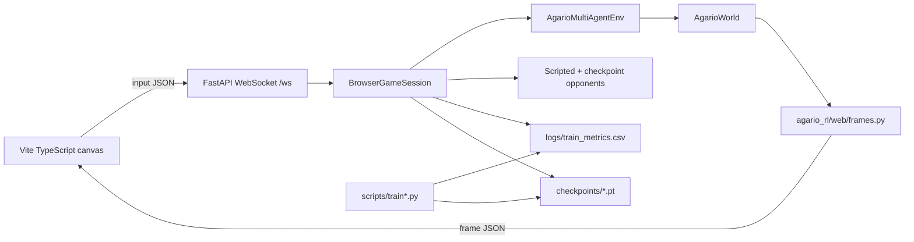

# Runtime architecture

The browser game is a local client over an authoritative Python simulation.
The browser never owns world rules. It renders frames and sends human input.



## Python server

`scripts/run_game.py` starts two local processes:

- FastAPI API on `127.0.0.1:8765`
- Vite frontend on `127.0.0.1:5173`

The FastAPI app is created by `agario_rl/web/server.py`. The live game endpoint
is `/ws`.

## Session runtime

`BrowserGameSession` in `agario_rl/web/runtime.py` owns one live arena:

- loads `config/default.yaml`
- applies the `full_arena` preset
- creates `AgarioMultiAgentEnv`
- selects human player `agent_0` in `play` mode
- assigns mixed scripted/checkpoint opponents
- advances physics at the simulator rate
- serializes every browser frame with `build_browser_frame`

`showcase` and `training-view` are no-save modes. They step the simulator and
read existing metrics; they do not write checkpoints or CSV logs.

## WebSocket messages

Browser input:

```json
{
  "type": "input",
  "steer": { "x": 1.0, "y": 0.0 },
  "split": false,
  "eject": false
}
```

Reset:

```json
{ "type": "reset" }
```

Frame payloads include:

- `agents`: cells, total mass, split counters, threat and target relations
- `pellets`, `viruses`, `ejected`: world objects for rendering
- `leaderboard`: sorted visible ranking
- `training`: policy source, checkpoint, latest update, metrics, and
  human-readiness counters
- `controls`: current human-control hints

## Browser renderer

The frontend lives in `web/src/main.ts` and `web/src/styles.css`.

Canvas responsibilities:

- draw the full arena, grid, world bounds, pellets, viruses, ejected mass, and
  cells
- interpolate between frames for smoother movement
- follow the human player or leading agent with refresh-rate-independent camera
  smoothing
- cull off-screen pellets and batch visible pellets by color
- draw edge indicators for off-screen threats and targets
- draw the minimap and viewport rectangle

DOM responsibilities:

- mode selector
- reset button
- leaderboard
- training state
- human-readiness counters
- runtime FPS and connection status

HUD writes are throttled separately from the display-rate canvas loop. This
separation keeps text readable without forcing DOM layout work every frame.

Mode changes replace the active WebSocket. Callbacks from the retired socket
are ignored, so its delayed `close` event cannot tear down the new connection.
Unexpected disconnects retry with bounded exponential backoff. The server uses
deadline-based 30 Hz pacing and awaits receiver-task cancellation during
cleanup, preventing timing drift and orphaned receive loops.

## Training boundary

Training commands still use the same Python env and PPO trainer. The browser is
not involved in gradient updates. A training command writes checkpoints and CSV
metrics; the browser runtime can read the latest metrics row to show visible
training state.
